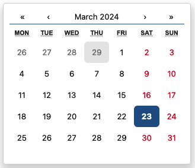
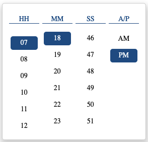
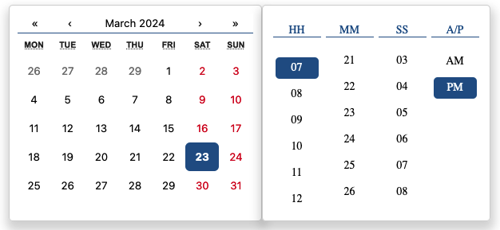

# Pickers-Inputs

React component library for handling date, time, and dateTime pickers with zone handling and customizable formats.

## Installation

You can install the package via npm or yarn:

```bash
npm install pickers-inputs
# or
yarn add pickers-inputs
```

## Usage

Import InputPicker from `pickers-inputs`;

```javascript
import { InputPicker } from "pickers-inputs";
```

Create state which will be used by the `InputPicker`:

```javascript
const [selectedDate, setSelectedDate] = useState("");
```

Add `InputPicker` like this:

```javascript
<InputPicker
  type="date"
  value={selectedDate}
  onChange={(newValue) => {
    setSelectedDate(newValue);
  }}
/>
```

### InputPickerProps

| Prop     | Type                   | Description                                                                                |
| -------- | ---------------------- | ------------------------------------------------------------------------------------------ |
| type     | PickerType             | Type of picker ("date", "time", "dateTime").                                               |
| value    | string                 | Value of the picker.                                                                       |
| onChange | (data: string) => void | Callback function triggered when the value changes. Receives the new value as an argument. |
| format   | string                 | Format of the displayed value. Input and output format will be the same.                   |
| onHide   | () => void             | Callback function triggered when the picker is hidden.                                     |
| onShow   | () => void             | Callback function triggered when the picker is shown.                                      |

## Date Picker



## Time Picker



## Date-Time Picker


